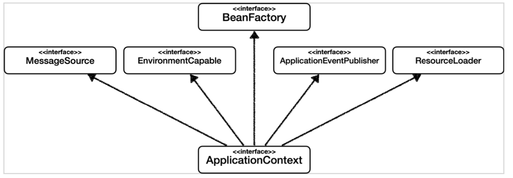

# 섹션 4. 스프링 컨테이너와 스프링 빈

## Spring Container

- ApplicationContext

  ``` java
  new AnnotationConfigApplicationContext(AppConfig.class);
  ```

  - ```AppConfig.class``` 에 등록된 구성 정보를 통해 스프링 컨테이너 생성

- AppConfig.class

  ```java
  @Bean
  public MemberService memberService() {
      return new MemberServiceImpl(memberRepository());
  }
  
  @Bean
  public OrderService orderService() {
      return new OrderServiceImpl(memberRepository(), discountPolicy());
  }
  
  @Bean
  public MemberRepository memberRepository() {
      return new MemoryMemberRepository();
  }
  
  @Bean
  public DiscountPolicy discountPolicy() {
      return new RateDiscountPolicy();
  }
  ```

  - ```memberService()```,``` orderService()``` -> ```memberRepository()```
    - 2개의 서비스를 실행 시, 코드상으로는 2개 이상 인스턴스가 생성되어야 하지만 하나의 인스턴스가 생성 됨
      - 스프링이 내부적으로 '싱글톤(Singleton) 패턴'으로 설계해줌

- ApplicationContext & BeanFactory

  - BeanFactory 

    - 스프링 컨테이너 최상위 인터페이스
    - 스프링 빈 관리 및 조회 -> ```getBean()``` 등 Bean 관련 메서드 제공
  - ApplicationContext
  
    - BeanFactory 기능 상속
      - MessageSorce
      - EnvironmentCapable
      - ApplicationEventPublisher
      - ResourceLoader
  

  <center></center>
